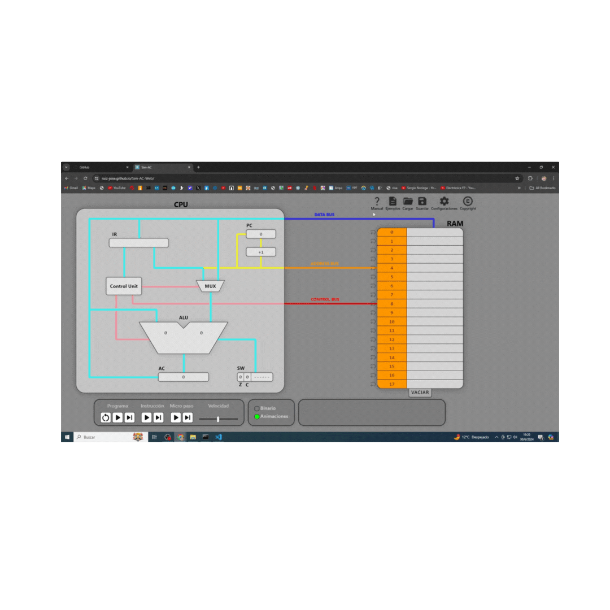

# Sim-AC-Web
Simulador Web Simulador arquitectura ACumulador

Try it [https://ruiz-jose.github.io/Sim-AC-Web/](https://ruiz-jose.github.io/Sim-AC-Web/)
  

## Features

- 📖 Integrated manual
- ✏️ Editable RAM, Program Counter, Accumulator and Status Word
- 🎛️ Controllable execution and execution speed
- 🔊 Togglable audio explainations of the execution
- 📜 Togglable text explainations of the execution
- 🏷️ Labels can be associated to addresses and used as operands inside instructions
- 📂 Programs can be saved/loaded from human readable .cpuvs files
- 🟢 Easy to follow and toggleable animations
- 🔟 Toggleable binary representation of data
- 🎨 Customizable busses and busses animations colors
- 🌐 3 supported languages (english, spanish and italian) and more to come